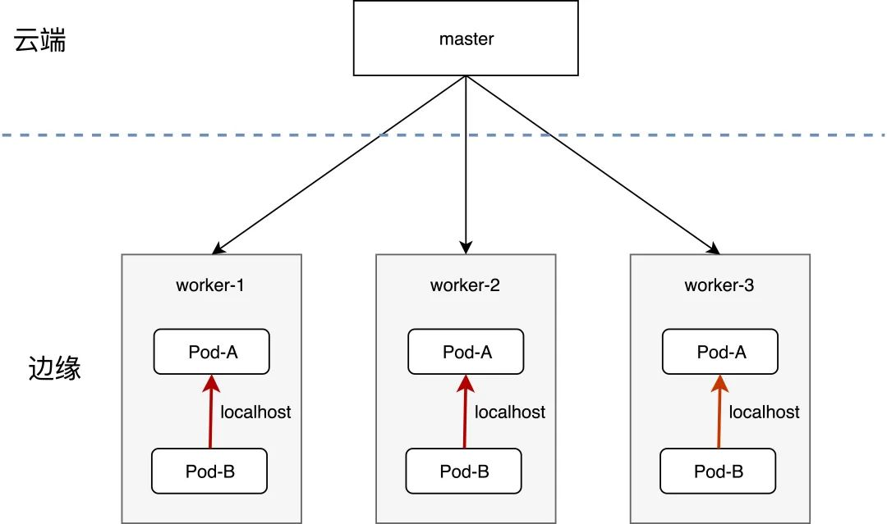
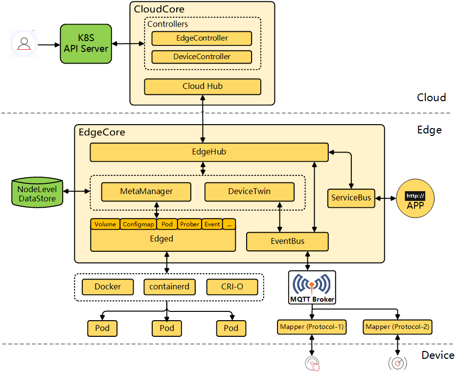
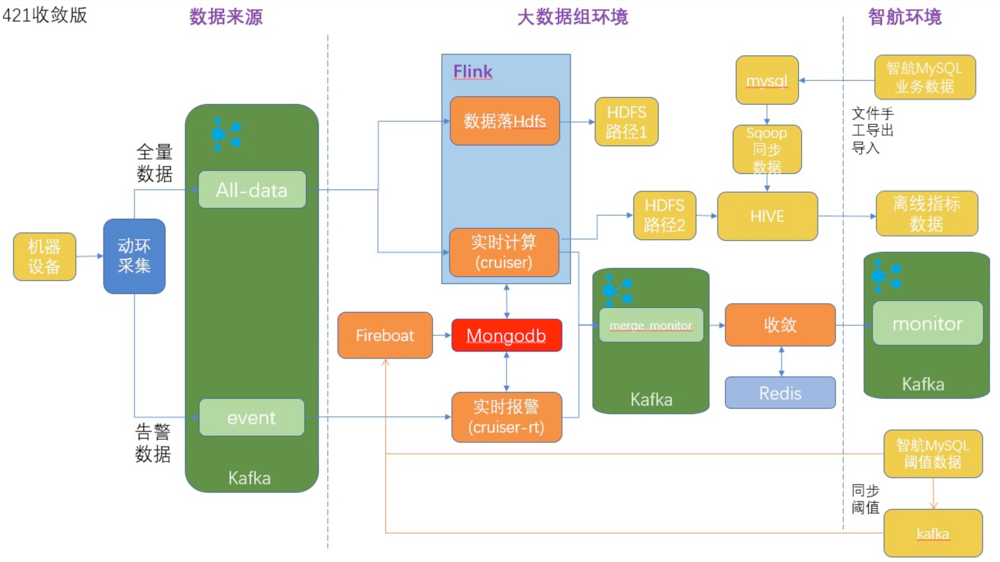

## 实时计算在 IDC 机房的发展

### 当前数据中心实时计算的应用场景

为了满足自身的业务发展需求，保证数据的稳定性和可靠性。无论是互联网还是传统行业，都会有自己或大或小的数据中心。数据中心一般由多个机房组成，各个机房之间一般呈现出星形的拓扑关系。云计算为了给用户提供稳定可靠的基础设施环境，需要对各个机房以及各个机房内部的物理服务器进行实时的健康检查和监控运维。

机房环境实时监控系统即是为了保证机房的安全、稳定、高效运行而建设的系统，主要是为了保证网络设备的良好运行状态和设备使用寿命与安全。为了实现用户的最大投资效益，就有必要对网络运行环境的电力供应、温度、湿度、漏水、空气含尘量等诸多环境变量，UPS、空调、新风、除尘、除湿等诸多设备运行状态变量，进行 24 小时不间断的实时监测与智能化调节控制，以保证网络运行环境的稳定与网络软硬件资源、设备的安全以及相关信息数据资产的安全。


### 当前的实时计算解决方案

当前世纪互联的机房环境实时监控系统主要是通过将实时传感器采集的相关数据如机房 UPS 电池的各项指标数据，通过 kafka 消息队列直接从边缘机房传输至中心机房，再结合 redis 元数据库，统一地通过中心化的一套 flink 大数据框架进行统一的实时计算并判断是否达到故障的指标阈值进而监控告警的。

Flink 作为一个广泛流行的实时计算框架，在实时计算领域有着广泛而坚实的应用场景和活跃的开源生态。该解决方案主要利用了 flink 的实时计算能力，有效地解决了以下问题：

- **低延迟性**：flink 大数据框架创新性地通过内存计算，极大地提高了之前批处理计算的性能，能实现分钟级乃至毫秒级的延迟；
- **生态好**：flink 开源社区已经存在大量的 source 和 sink 插件，可以直接与外部大数据系统进行集成，极大地减轻了开发和运维的成本；
- **易用性**：flink 支持多种作业提交模式，包括 SQL、jar 包、以及 scala 或 python 代码片段，具有非常好的易用性；
- **运维成本低**：flink 可以直接对外暴露 metrics 监控数据，对接 prometheus 进行监控告警和 EFK 进行日志排障；


## 当前面临的挑战

虽然目前通过一套中心化的 flink 计算框架可以有效地实现机房环境的实时监控告警，但是也面临着诸多挑战，存在着一系列需要改进和优化的地方：

- **效率**

从前面的介绍中我们可以看出，目前边缘机房的传感器数据需要通过 kafka 消息队列全量同步到中心机房，再进行统一的流式计算。这个过程效率比较低下，海量的传感器数据跨机房传输既无十分的必要，也给系统带来了很大的压力。

通过边缘计算的理念，计算应该尽量在靠近物或者数据源头的网络边缘侧，融合边缘节点的网络、计算、存储能力，就近提供边缘的智能服务。既可以满足实时业务、数据优化、应用智能、安全和隐私等多方面的问题，也可以实现绿色高效、带宽充足、低延迟性等核心目标，可以有效地解决集中式云计算所难以解决的问题。

- **环境差异**

当前 flink 集群构建于虚拟机之上，由于不同厂商交付的资源差异巨大，很容易遇到部署环境相关的问题，加上配置繁琐，部署低效，很容易出错。另外，边缘节点多且变动性大，也带来了极大的不确定性和额外的部署运维成本。

容器技术是最近几年发展势头很好的技术之一，相比物理机和虚拟机，容器技术非常轻量级，并且具有如下优点：部署简单、支持多环境、启动时间更短、易扩容、易迁移。这些特点很好地解决了 “环境差异” 这一问题。

- **网络稳定性**

同上所述，目前边缘机房的传感器数据需要全量同步到中心机房，这带来了极大的网络压力，占用了大量的机房间网络带宽，且存在着不可预知的网络延迟。通过引入边缘计算，调度计算程序而不是数据将极大地缓解网络带宽压力和资源成本。

- **成本**

海量传感器数据的跨机房传输不仅带来了不必要的网络带宽成本，也带来了大量的网络延迟和计算延迟。另外，目前应用没有进行容器化也带来了很大的运维成本，通过 flink on kubeedge 边缘容器计算能力，将能有效地降低带宽成本、时间成本和运维成本。


## Flink On KubeEdge 方案介绍

根据目前的解决方案和面临的实际挑战，本次改造方案选用 Flink On KubeEdge 进行。

### KubeEdge 介绍

容器技术虽然很好地解决了“环境差异”的问题，但是在管理主机数量规模较大的业务场景时，单机容器管理方案往往力不从心。kubernetes 是当前最流行的容器编排和管理系统，它实现了一套高效的应用管理、应用自修复、资源管理、线上运维和排障机制，并且形成了监控告警、服务网格、日志及调用链分析、CI/CD等方面的一系列生态。这些有助于解决 “缺失技术标准和规范”、“没有统一的体系结构”、“服务质量保障”、“管理成本高”等方面的问题。



Kubernetes 作为容器编排的标准，自然会想把它应用到边缘计算上，即通过 kubernetes 在边缘侧部署应用，但是 kubernetes 在边缘侧部署应用时遇到了一些问题，例如：

- 边缘侧设备没有足够的资源运行一个完整的 Kubelet；
- 一些边缘侧设备是 ARM 架构的，然而大部分的 Kubernetes 发行版并不支持 ARM 架构；
- 边缘侧网络很不稳定，甚至可能完全不通，而 kubernetes 需要实时通信，无法做到离线自治；
- 很多边缘设备都不支持TCP/IP 协议；
- Kubernetes 客户端（集群中的各个Node节点）是通过 list-watch 去监听 Master 节点的 apiserver 中资源的增删改查，list-watch 中的 watch 是调用资源的 watch API 监听资源变更事件，基于 HTTP 长连接实现，而维护一个 TCP 长连接开销较大。从而造成可扩展性受限。


正是为了解决包含但不限于以上 Kubernetes 在物联网边缘场景下的问题，从而产生了KubeEdge 。对应以上问题：

- KubeEdge 保留了 Kubernetes 的管理面，重新开发了节点 agent，大幅度优化让边缘组件资源占用更低很多；
- KubeEdge 可以完美支持 ARM 架构和 x86 架构；
- KubeEdge 有离线自治功能，可以看 MetaManager 组件的介绍；
- KubeEdge 丰富了应用和协议支持，目前已经支持和计划支持的有：MQTT、BlueTooth、OPC UA、Modbus等；
- KubeEdge 通过底层优化的多路复用消息通道优化了云边的通信的性能，可以看 EdgeHub 组件的介绍；


**KubeEdge 基本原理：**



KubeEdge 由以下组件构成：

**云边通信**

- CloudHub: CloudHub 是一个 Web Socket 服务端，用于大量的 edge 端基于 websocket 或者 quic 协议连接上来。负责监听云端的变化,，缓存并发送消息到 EdgeHub。
- EdgeHub: 是一个 Web Socket 客户端，负责将接收到的信息转发到各 edge 端的模块处理；同时将来自个 edge 端模块的消息通过隧道发送到 cloud 端。提供可靠和高效的云边信息同步。

**云上部分**

- EdgeController: 用于控制 Kubernetes API Server 与边缘的节点、应用和配置的状态同步。
- DeviceController: DeviceController 是一个扩展的 Kubernetes 控制器，管理边缘设备，确保设备信息、设备状态的云边同步。

**边缘部分**

- MetaManager: MetaManager 模块后端对应一个本地的数据库（sqlLite），所有其他模块需要与 cloud 端通信的内容都会被保存到本地 DB 种一份，当需要查询数据时，如果本地 DB 中存在该数据，就会从本地获取，这样就避免了与 cloud 端之间频繁的网络交互；同时，在网络中断的情况下，本地的缓存的数据也能够保障其稳定运行（比如边缘机房与中心机房的专线连接出现网络抖动甚至中断），在通信恢复之后，重新同步数据。是边缘节点自治能力的关键；
- Edged: 是运行在边缘节点的代理，用于管理容器化的应用程序。算是个重新开发的轻量化 Kubelet，实现 Pod，Volume，Node 等 Kubernetes 资源对象的生命周期管理。
- EventBus: EventBus 是一个与 MQTT 服务器（mosquitto）交互的 MQTT 客户端，为其他组件提供订阅和发布功能。
- ServiceBus: ServiceBus 是一个运行在边缘的 HTTP 客户端，接受来自云上服务的请求，与运行在边缘端的 HTTP 服务器交互，提供了云上服务通过 HTTP 协议访问边缘端 HTTP 服务器的能力。
- DeviceTwin: DeviceTwin 负责存储设备状态并将设备状态同步到云，它还为应用程序提供查询接口。


**KubeEdge的优势主要包括：**

- **边缘计算**

  借助在 Edge 上运行的业务逻辑，可以让本地生成的数据，进行大量数据处理操作并对其进行保护。这样可以减少边缘和云之间的网络带宽需求和消耗，提高响应速度，降低成本并保护客户的数据隐私。

- **简化开发**

  开发人员可以编写基于 HTTP 或 MQTT 的常规应用程序，对其进行容器化，然后在 Edge 或 Cloud 中的任何一个更合适的位置运行应用程序。

- **Kubernetes原生支持**

  借助 KubeEdge，用户可以像在传统的 Kubernetes 集群一样，在 Edge 节点上编排应用程序，管理设备并监视应用程序和设备状态。

- **丰富的应用**

  可以轻松地将现有的复杂机器学习，图像识别，事件处理等其他高级应用程序部署到 Edge 节点。

  

### Flink On Edge 的优势

Meta42 结合 Flink 的流式计算数据聚合能力和 KubeEdge 的边缘计算能力将 Flink 任务调度到边缘节点，至少将带来以下几方面的优势：

- **效率更高**

  结合 Flink 的实时计算能力与 KubeEdge 的边缘计算能力，应用将具备在边缘侧自治和边缘计算的能力，可以充分地利用本地计算的优势，

- **成本更低**

  该解决方案沿用了之前的 flink 实时计算框架，在降低二次开发成本的同时，引入了边缘计算，在边缘端对原始数据进行清洗，数据在边缘计算并收敛，再将计算后的数据上报云端，可以大大减少数据传输的带宽成本。另外，通过 k8s 的容器化云原生部署也使得应用的运维成本更低。

- **边云协同的一致体验**

  KubeEdge 完全兼容目前最流行的容器编排标准 Kubernetes ，便于边云统一管理和云边协同工作以及让资源调度更加高效、稳定和低成本。

- **网络稳定性**

  KubeEdge 通过 hub 组件解决了边到云的弱网络问题，该组件代理了边缘节点上所有核心组件向 apiserver  发起的请求，并且将关键数据持久化保存在本地。当云边网络异常时，节点侧依然可以使用这些数据，避免因云边弱网络原因引起业务异常，能很好地适应边缘节点的弱网环境，提高应用的稳定性。


## Flink On Edge 具体实现和效果

### kubeedge 边缘集群搭建

1. **安装 k8s 1.20.8系统**

   本次安装使用 k8s 1.20.8 版本与 kubeedge v1.10.0 版本，若安装其它版本请注意二者的版本兼容性。

2. **下载最新的 keadm 安装包**

   本次安装使用 kubeedge  v1.10.0 版本，安装包请移步github下载，地址为 https://github.com/kubeedge/kubeedge/releases/tag/v1.10.0，根据合适的系统架构选择下载 keadm 安装包以及 kubeedge 安装包，x86_64 架构的系统请选择，kubeedge-v1.10.0-linux-amd64.tar.gz。

3. **解压并放置在合适的目录**

   Keadm 请放置在 PATH 路径下，kubeedge 请解压后放置在 /etc/kubeedge/kubeedge-v1.10.0-linux-amd64，手工下载后可以避免 keadm 安装时需要在线下载 kubeedge，kubeedge 在线下载可能会遇到网路访问问题。 

4. **开始安装 kubeedge 云端组件**

   使用如下命令进行安装 kubeedge 云端组件，最好是在 k8s master 节点上操作，让 kubeedge 云端组件和 k8s master 跑在一个节点上，命令如下：

   `keadm init --advertise-address="172.22.243.104" --kubeedge-version=1.10.0 --kube-config=/root/.kube/config`， 其中 advertise-address 即云端组件对外暴露的签名可信访问地址，因为 kubeedge 云端组件和 k8s master 跑在一个节点，172.22.243.104 既是 k8s master 的地址也是 kubeedge 云端组件的部署地址，--kube-config 指定访问 k8s kubeconfig 路径。kubeedge-version 默认为 1.10.0。

   需要注意的是，安装 kubeedge 云端组件需要预留两个端口 10000 以及 10002。

   安装后，可以通过命令查看相关信息如下：

   ```bash
   # ps -ef | grep cloudcore
   root      88636  88613  1 Apr12 ?        02:37:53 cloudcore
   # netstat -tunlp | grep cloudcore
   tcp6       0      0 :::10000                :::*                    LISTEN      88636/cloudcore
   tcp6       0      0 :::10002                :::*                    LISTEN      88636/cloudcore
   tcp6       0      0 :::10003                :::*                    LISTEN      88636/cloudcore
   tcp6       0      0 :::10004                :::*                    LISTEN      88636/cloudcore
   # pwd
   /etc/kubeedge
   # ls
   ca  certs  config  crds  kubeedge-v1.4.0-linux-amd64  kubeedge-v1.4.0-linux-amd64.tar.gz
   # cat config/cloudcore.yaml
   apiVersion: cloudcore.config.kubeedge.io/v1alpha1
   kind: CloudCore
   kubeAPIConfig:
     burst: 200
     contentType: application/vnd.kubernetes.protobuf
     kubeConfig: /root/.kube/config
     master: ""
     qps: 100
   ......
     syncController:
       enable: true
   ```

5. **安装edge组件**

   边缘节点是一台安装有 docker 服务的 centos 机器，并且未加入 k8s 集群。

   - 从云端节点上获取token

     `kubectl get secrets tokensecret -n kubeedge --template={{.data.tokendata}} | base64 -d`

   - 在边缘节点上安装 edge 组件

     `keadm join --cloudcore-ipport=172.22.243.104:10000  --token=xxxxxxxxxxxx`

     其中 cloudcore-ipport 即云端节点地址以及暴露的端口号。

   - 修改 edgecore 配置

     为了能够调用边缘主机容器运行时的能力，需要修改如下 edgecore 配置：

     ```yaml
       edged:
         ## 使用主机的 cgroupDriver
         cgroupDriver: systemd
     
     ......
       ## 启用流式查询能力
       edgeStream:
         enable: true
         handshakeTimeout: 30
         readDeadline: 15
         server: 172.22.243.104:10004
     ```

6. **重启 edgecore**

   `systemctl restart edgecore`

7. **检查边缘节点部署**

   ```bash
   # ps -ef | grep edgecore
   root      9361     1  1 11:46 ?        00:01:29 /etc/kubeedge/edgecore
   # pwd
   /etc/kubeedge
   # ls
   ca  certs  config  edgecore  edgecore.service  kubeedge-v1.4.0-linux-amd64  kubeedge-v1.4.0-linux-amd64.tar.gz
   # cat config/edgecore.yaml
   apiVersion: edgecore.config.kubeedge.io/v1alpha1
   database:
     aliasName: default
     dataSource: /var/lib/kubeedge/edgecore.db
     driverName: sqlite3
   kind: EdgeCore
   Modules:
     dbTest:
       enable: false
     deviceTwin:
       enable: true
     edgeHub:
       enable: true
       heartbeat: 15
       httpServer: https://172.22.243.104:10002
       projectID: e632aba927ea4ac2b575ec1603d56f10
       quic:
         handshakeTimeout: 30
         readDeadline: 15
         server: 172.22.243.104:10001
         writeDeadline: 15
       rotateCertificates: true
       tlsCaFile: /etc/kubeedge/ca/rootCA.crt
       tlsCertFile: /etc/kubeedge/certs/server.crt
       tlsPrivateKeyFile: /etc/kubeedge/certs/server.key
       token: xxxxxxxx
       websocket:
         enable: true
         handshakeTimeout: 30
         readDeadline: 15
         server: 172.22.243.104:10000
         writeDeadline: 15
   ......
     serviceBus:
       enable: false
   ```

8. **在k8s master节点上查看对应的节点**

   ```bash
   NAME                     STATUS   ROLES                  AGE   VERSION                    INTERNAL-IP      EXTERNAL-IP   OS-IMAGE                KERNEL-VERSION           CONTAINER-RUNTIME
   14edge                   Ready    agent,edge             11d   v1.22.6-kubeedge-v1.10.0   172.22.96.14     <none>        CentOS Linux 7 (Core)   3.10.0-1160.el7.x86_64   docker://1.13.1
   kubedata-master          Ready    control-plane,master   81d   v1.20.8                    172.22.243.104   <none>        CentOS Linux 7 (Core)   3.10.0-1160.el7.x86_64   docker://20.10.7
   kubedata-slave1          Ready    worker                 20d   v1.20.8                    172.22.243.105   <none>        CentOS Linux 7 (Core)   3.10.0-1160.el7.x86_64   docker://20.10.7
   kubedata-slave2-harbor   Ready    infra-es,worker        81d   v1.20.8                    172.22.243.106   <none>        CentOS Linux 7 (Core)   3.10.0-1160.el7.x86_64   docker://20.10.7
   ```

   备注，14edge 即边缘节点，并且携带有 [node-role.kubernetes.io/edge](http://node-role.kubernetes.io/edge) 这个 label。

9. **对边缘节点增加污点，部署增加容忍，以增强边缘节点的隔离**

   `kubectl taint nodes 14edge edge=true:NoSchedule`

   

### Flink 边缘计算作业

**Meta42 Flink 作业基本逻辑**



如图所示，在边缘侧，通过动环传感器进行 24 小时不间断地采集 UPS、空调、新风、除尘、除湿等诸多设备运行状态变量的全量数据都会进入 kafka 消息队列，通过 Flink Operator 创建 Flink Per-Job 边缘集群，通过设置 node affinity 将 flink taskmanager、jobmanager 等组件直接运行在边缘节点。

每个边缘数据中心都有一个 Flink 集群，传感器采集的数据直接在本地进行实时计算之后，生成收敛的告警结果数据，这些数据会被汇总到特定的 kafka topic 供其它系统消费使用。


**部署 Flink operator**

flink operator 可以通过 k8s crd 以一种声明式的方式定义并创建和管理多个 flink 集群。operator 本身以 deployment 的方式无状态部署：

```yaml
# kubectl apply -f config/deployment

# kubectl get all|grep flink-cluster-operator
pod/flink-cluster-operator-758cf5856d-q9zkj    2/2     Running     0          4d2h
deployment.apps/flink-cluster-operator   1/1     1            1           4d3h
replicaset.apps/flink-cluster-operator-758cf5856d   1         1         1       4d2h
```


**Meta42 Flink 作业打包**

首先，需要修改相关生产环境配置信息如 redis、hdfs，然后将 flink 作业程序打包成 jar 包：

`mvn clean package`

再将 jar 包打包成容器镜像：

可使用如下的 Dockerfile 文件：

```dockerfile
FROM maven:3.6-jdk-8-slim AS builder

# Get flink job and compile it
COPY ./java/com/neolink /opt/flink-neolink-job
WORKDIR /opt/flink-neolink-job
RUN mvn clean install

FROM apache/flink:1.13.1-scala_2.12-java8

WORKDIR /opt/flink/bin

# Copy Flink Job jar
COPY --from=builder /opt/flink-neolink-job/target/flink-neolink-job-*.jar /opt/flink-neolink-job.jar
```

使用 `docker build . -t 172.22.243.106/system_containers/flink-edge-cruiser:1.0.0` 命令即可构建出 job 容器镜像。


**Meta42 Flink 作业提交**

创建如下的 FlinkCluster 资源，并提交到 k8s 集群：

```yaml
apiVersion: daas.tenxcloud.com/v1
kind: FlinkCluster
metadata:
  name: flink-edge-cruiser
spec:
  image:
      name: 172.22.243.106/system_containers/flink-edge-cruiser:1.0.0
      pullPolicy: Always
  flinkProperties:
    taskmanager.memory.flink.size: 800MB
    taskmanager.numberOfTaskSlots: "1"
  jobManager:
    accessScope: Cluster
    ports:
      ui: 8081
    resources:
      limits:
        memory: "2Gi"
        cpu: "200m"
  taskManager:
    replicas: 1
    resources:
      limits:
        memory: "2Gi"
        cpu: "200m"
    tolerations:
        - key: "node.kubernetes.io/unschedulable"
          operator: Exists
    affinity:
      nodeAffinity:
        requiredDuringSchedulingIgnoredDuringExecution:
          nodeSelectorTerms:
            - matchExpressions:
                - key: node-role.kubernetes.io/edge
                  operator: Exists
  job:
    jarFile: /opt/flink/examples/cruiser-2.0.jar
    restartPolicy: Never
    className: com.neolink.Entrance
    args:
      [
        "--topic.names",
        "m3_monitor",
        "--config.name",
        "dev.properties",
        "--job.name",
        "flink-edge-cruiser",
        "--consumer.name",
        "test",
        "--dc.id",
        "24",
      ]
    parallelism: 10
```

其中部分参数定义如下：

- -job.name：提交的任务名
- -topic.names：消费数据的 kafka 的 topic
- -config.name：指定配置文件，dev.properties 为消费生产 kafka 数据，输出到测试 kafka
- -dc.id：数据中心 ID
- -consumer.name：消费 kafka 的消费者组

创建相应的 FlinkCluster k8s 资源后会生成一个对应的 job-submitter job，查看 job 运行日志：

```yaml
# kubectl logs flink-edge-cruiser-job-submitter-n4tbp
---------- Checking job manager status ----------
Checking job manager to be ready. Will check success of 2 API calls for stable job submission.
curl -sS "http://flink-edge-cruiser-jobmanager:8081/jobs"
curl: (7) Failed to connect to flink-edge-cruiser-jobmanager port 8081: Connection refused

Waiting...
curl -sS "http://flink-edge-cruiser-jobmanager:8081/jobs"
curl: (7) Failed to connect to flink-edge-cruiser-jobmanager port 8081: Connection refused

Waiting...
curl -sS "http://flink-edge-cruiser-jobmanager:8081/jobs"
curl: (7) Failed to connect to flink-edge-cruiser-jobmanager port 8081: Connection refused

Waiting...
curl -sS "http://flink-edge-cruiser-jobmanager:8081/jobs"
curl: (7) Failed to connect to flink-edge-cruiser-jobmanager port 8081: Connection refused

Waiting...
curl -sS "http://flink-edge-cruiser-jobmanager:8081/jobs"
curl: (7) Failed to connect to flink-edge-cruiser-jobmanager port 8081: Connection refused

Waiting...
curl -sS "http://flink-edge-cruiser-jobmanager:8081/jobs"
{"jobs":[]}
Success 1/2

Waiting...
curl -sS "http://flink-edge-cruiser-jobmanager:8081/jobs"
{"jobs":[]}
Success 2/2

Job manager is ready now. Tried 7 time(s), every 5s and succeeded 2 time(s).

---------- Submitting job ----------
/opt/flink/bin/flink run --jobmanager flink-edge-cruiser-jobmanager:8081 --class com.neolink.Entrance --parallelism 10 --detached /opt/flink/examples/cruiser-2.0.jar --topic.names m3_monitor --config.name dev.properties --job.name flink-edge-cruiser --consumer.name test --dc.id 24
Starting execution of program
Job has been submitted with JobID a3dbdfb7ea014294422bd82215a1c3ab
```

查看发现日志正常，job 创建成功。查看对应的 kafka 消息队列，发现对应的 topic 中已有相应的结果输出。


## 小结和未来计划

综上所述，通过 Flink On KubeEdge 的一整套解决方案，我们将 Flink 集群运行在了边缘数据中心，解决了弱网环境下的数据延迟和性能瓶颈问题，能较好地满足目前 meta42 机房的监控告警需求。未来，我们将基于此方案进一步优化和升级，可能包括如下几方面：

- 发布 Flink on KubeEdge 的 operator 开源项目；
- 发布 DevOps 套件，配合 Flink 以 perJob 方式运行在边缘计算节点上；
- 探索边缘 Flink 集群算力控制方式；
- ......


